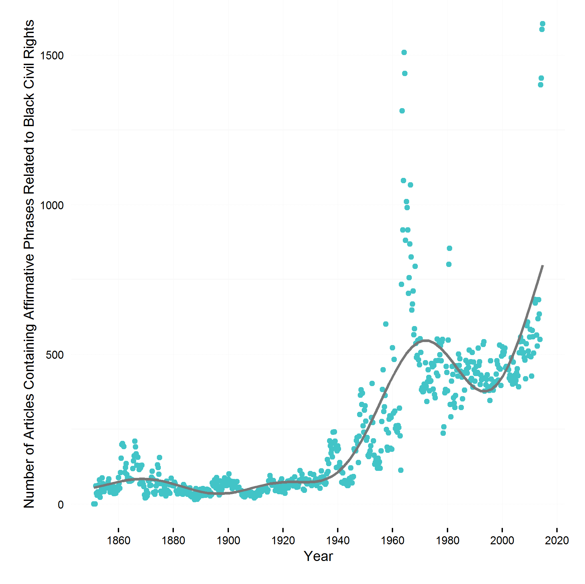

## Civil Rights Coverage in the NYT Over Time

Track the number of news stories about African American civil rights issues over the decades.

Keywords: 
affirmative action, racial, african american, black, negro, racial discrimination, civil rights, segregation

1. [Yearly coverage using the NYT Chronicle](http://chronicle.nytlabs.com/?keyword=civil%20rights.black.african%20american.negro.racial.voting%20rights.racial%20descrimination.segregation.affirmative%20action.affirmative%20action.busing)

2. Get your own data: 
Start by getting a [NYT Article Search API key](http://developer.nytimes.com/apps/register)
    * R script [using rtimes package](scripts/using_rtimes.R). [Quarterly Data](nyt_rtimes.csv)
    * R script [using jsonlite](scripts/using_jsonlite.R).

3. Script for [plotting the data](scripts/plot.R). See the [graph (pdf)](figs/nyt_aa.pdf)

**Note** 

The scripts track number of articles containing the keyword search. But sometimes a more apt unit of measurement is proportion of articles mentioning the search term. The point is especially important over great lengths of time as over time the number of articles published in the NYT has been increasing. To get proportion of articles, you need to use the 'source facet'. For instance, if you look at the end of the output given by the following
[API Request](http://api.nytimes.com/svc/search/v2/articlesearch.json?api-key=c2fede7bd9aea57c898f538e5ec0a1ee:6:68700045&facet_field=source&facet_filter=true&begin_date=20150710&end_date=20150710), you will see total number of articles from various sources (Reuters, AP, NYT, Internet Video Archive, CNBC etc.) for the specified date (2015-07-10).       

### License

Scripts are released under the [MIT License](https://opensource.org/licenses/MIT).
